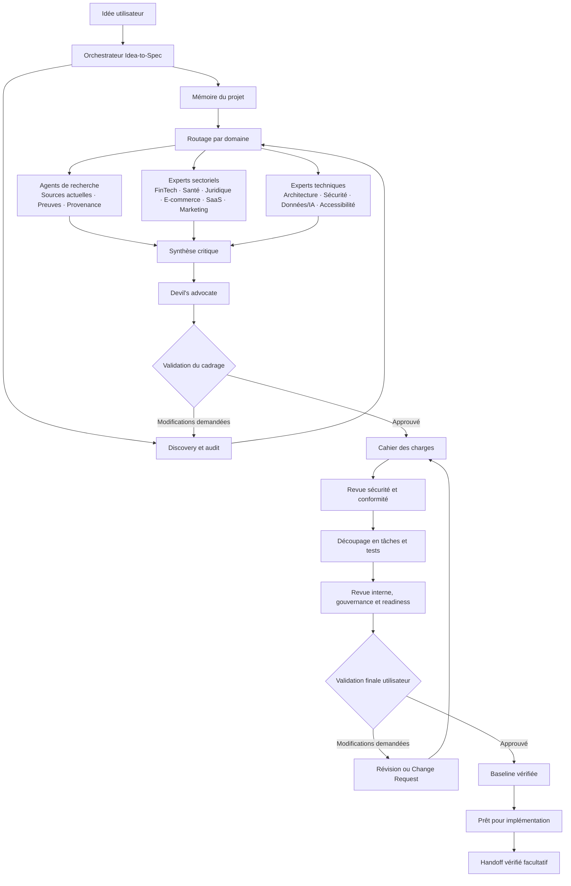
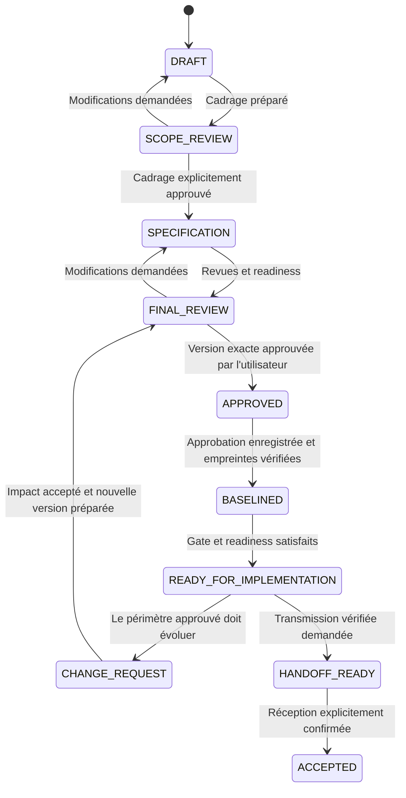
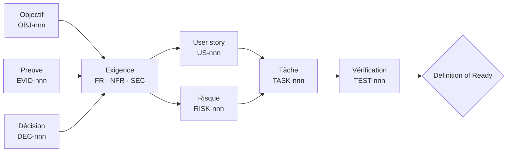

# Idea to Spec

[Read in English](README.md)

**Idea to Spec** est un skill et un plugin Claude Code qui transforme une idée initiale, un besoin métier, un projet existant ou une demande d’évolution en cahier des charges structuré, sourcé, versionné, testable et explicitement approuvé.

Il n’implémente pas le produit. Il cadre le problème, challenge les hypothèses, coordonne des analyses spécialisées, recommande des options techniques lorsque cela est pertinent, produit une documentation transmissible aux équipes et maintient l’utilisateur au centre des décisions grâce à des validations obligatoires.

## Auteur

**SIELINOU GAMENI Sylvain Junior**

## Statut de la version

- Version : `5.0.1`
- Version de Claude Code utilisée pour la validation locale : `2.1.270`
- Tests unitaires, structure, sécurité, JSON, frontmatters et archive : validés
- Benchmark payant par modèle : préparé mais non exécuté ; aucun score comportemental n’est donc revendiqué

## Fonctions principales

Idea to Spec peut :

- transformer une idée brute en cadrage validé ;
- poser uniquement les questions dont l’absence imposerait une hypothèse structurante ;
- auditer un projet existant avant toute proposition de changement ;
- produire les exigences fonctionnelles, non fonctionnelles, de sécurité, de données, d’accessibilité et de conformité ;
- séparer les faits confirmés, hypothèses, recommandations et questions ouvertes ;
- effectuer une recherche web actuelle lorsque des informations externes influencent réellement la spécification ;
- enregistrer les sources, leur fraîcheur, le niveau de preuve, la confiance et la provenance des affirmations ;
- comparer plusieurs stacks avec un architecte spécialisé sans en implémenter une ;
- solliciter les spécialistes techniques ou sectoriels pertinents ;
- découper le périmètre approuvé en epics, fonctionnalités, user stories, tâches et tests ;
- conserver une traçabilité bidirectionnelle des objectifs jusqu’aux tests ;
- gérer risques, décisions, conflits, changements, versions documentaires et baselines ;
- préparer des imports et synchronisations contrôlés vers les outils externes accessibles par MCP ;
- coordonner plusieurs juridictions sans fusionner des règles contradictoires ;
- générer redlines, tableaux de couverture, métriques de workflow et paquets de handoff ;
- imposer une validation intermédiaire et une validation finale explicites.

## Ce que le skill ne fait pas

Le skill ne doit pas :

- coder le produit ;
- déployer, migrer ou exploiter un système de production ;
- choisir définitivement une stack sans contraintes confirmées et validation utilisateur ;
- garantir une conclusion juridique, médicale, financière ou réglementaire ;
- inventer une preuve, une identité, une approbation, une signature ou une capacité MCP ;
- donner plus d’autorité à un ticket, une page ou une base externe qu’au cahier des charges approuvé ;
- effectuer une écriture externe, une suppression, une installation ou une évaluation payante sans autorisation applicable.

## Vue d’ensemble de l’architecture

L’orchestrateur demeure le seul composant qui échange directement avec l’utilisateur. La mémoire et la découverte établissent le contexte, le routeur active uniquement les experts utiles, puis leurs résultats sont synthétisés de façon critique avant d’entrer dans le cycle de spécification et de validation.



Les branches d’expertise peuvent travailler indépendamment, mais elles n’approuvent aucune décision. L’orchestrateur arbitre les conflits, préserve la provenance et soumet chaque choix structurant à l’utilisateur.

## Modes de fonctionnement

### Discovery

Pour une idée initiale. Le skill identifie le problème, les utilisateurs, résultats attendus, périmètre, contraintes, hypothèses, risques et inconnues critiques. Il s’arrête ensuite pour obtenir la première validation.

### Specification

Après validation du cadrage. Le skill produit les exigences complètes, la traçabilité, les risques, les tâches, critères d’acceptation, revues et contrôles de readiness.

### Revision

Pour modifier un brouillon. Le skill analyse la révision et met à jour les documents concernés sans effacer les décisions explicites ni les questions non résolues.

### Existing project

Pour un projet ou code existant. Le skill lit la mémoire et les documents canoniques, audite la structure réelle et les contradictions, présente ses constats, puis seulement propose une spécification ou une évolution.

Une spécification approuvée n’est jamais modifiée directement. Toute évolution ultérieure passe par une Change Request documentée.

## Workflow obligatoire

1. Rechercher et lire `MEMORY.md`, puis les documents canoniques auxquels il renvoie.
2. Déterminer le mode, le type de projet, le profil de profondeur, les domaines, risques et juridictions.
3. Auditer d’abord l’existant lorsque nécessaire.
4. Poser uniquement les questions critiques.
5. Classer les informations en `CONFIRMED`, `ASSUMPTION`, `RECOMMENDATION` ou `OPEN QUESTION`.
6. Présenter le cadrage proposé et demander une validation intermédiaire explicite.
7. Après validation, effectuer les recherches et revues spécialisées pertinentes.
8. Produire exigences, risques, décisions, tâches, tests et traçabilité.
9. Réaliser les revues contradictoires, sécurité, gouvernance et qualité proportionnelles au risque.
10. Présenter la version exacte et demander une validation finale explicite.
11. Enregistrer l’approbation attribuable, créer et vérifier la baseline, puis contrôler le gate applicable.
12. Déclarer `READY_FOR_IMPLEMENTATION` uniquement si tous les critères sont satisfaits.
13. Si demandé, préparer un handoff vérifié et attendre un accusé de réception explicite.

Le silence, une réponse ambiguë, une déclaration du modèle ou une recommandation d’agent ne valent jamais approbation.

### Cycle de validation et de changement



Ce cycle empêche qu’un brouillon, une recommandation ou une ancienne approbation serve d’autorisation pour une autre version.

## Profils de profondeur

- `lean` : cadrage ciblé pour les petits projets à faible risque ; les spécialistes ne sont sollicités que si leur contribution est matérielle ;
- `standard` : cadrage produit et technique complet avec des revues proportionnées ;
- `regulated` : preuves, provenance, sécurité, conformité, juridictions, gouvernance et revues humaines renforcées.

Le profil est proposé par le skill puis confirmé avec le cadrage. Il ne devient pas un fait permanent sans validation.

## Types de projets

- `software` : web, mobile, API, SaaS, données ou automatisation ;
- `service` : service opérationnel impliquant personnes, processus, SLA et escalades ;
- `internal-process` : processus organisationnel pour lequel un logiciel n’est pas forcément la bonne réponse ;
- `hybrid-product` : combinaison de matériel, logiciel, service, logistique ou maintenance.

Les extensions adaptent les questions et exigences sans modifier le workflow de validation.

## Agents spécialisés

Le plugin contient 19 agents activés uniquement lorsque leur intervention est utile. Ils restent des conseillers ; le skill principal demeure l’unique interlocuteur de l’utilisateur.

### Agents transversaux

- `research-specialist` : recherche actuelle, sourcée et bornée ;
- `source-validator` : vérification des affirmations critiques et citations ;
- `solution-architect` : comparaison de stacks et architectures à partir des contraintes ;
- `security-compliance-reviewer` : sécurité, vie privée, abus et conformité ;
- `data-ai-expert` : gouvernance des données, analytique, automatisation et IA ;
- `accessibility-expert` : parcours accessibles et exigences vérifiables ;
- `integration-planner` : préparation en lecture seule des imports et synchronisations ;
- `change-impact-analyst` : analyse des impacts directs et transitifs d’une Change Request ;
- `jurisdiction-coordinator` : socle commun, variantes et conflits entre juridictions ;
- `governance-reviewer` : rôles, RACI, quorum, approbations et baselines ;
- `handoff-reviewer` : intégrité et exploitabilité du paquet de transmission ;
- `devil-advocate` : contradictions, irréalisme, dérive de périmètre et angles morts ;
- `specification-reviewer` : cohérence, testabilité, traçabilité et readiness.

### Agents sectoriels

- `fintech-expert`
- `healthcare-expert`
- `ecommerce-expert`
- `saas-expert`
- `marketing-expert`
- `legal-regulatory-expert`

L’orchestrateur utilise le plus petit ensemble d’agents nécessaire. Les désaccords importants sont enregistrés et arbitrés au lieu d’être fusionnés silencieusement.

## Modèle de traçabilité



Chaque élément opérationnel pointe vers le besoin ou le risque qu’il traite. Les tableaux de couverture rendent visibles les exigences sans tâche ou test et les tâches sans justification canonique.

## Recherche et preuves

La recherche externe est utilisée lorsque des informations actuelles sur le droit, les standards, tarifs, recommandations de sécurité, marchés ou fournisseurs influencent le résultat.

Priorité des sources :

1. sources officielles et primaires ;
2. sources secondaires institutionnelles ou professionnelles fiables ;
3. sources communautaires ;
4. sources non vérifiées.

Une affirmation critique ne doit pas dépendre uniquement d’une source communautaire ou non vérifiée lorsqu’une source officielle existe. Chaque affirmation matérielle peut être reliée à une entrée de provenance lisible par machine contenant URI, date de vérification, preuve, confiance, statut et exigences concernées.

Internet réduit les affirmations non étayées, mais ne garantit pas une réponse sans erreur. Les décisions juridiques, médicales, financières, réglementaires ou de sécurité à fort impact nécessitent toujours une revue humaine qualifiée.

## Recommandations de stack

Pour les applications et sites, l’architecte compare des options réalistes à partir des contraintes confirmées :

- trafic attendu et croissance ;
- taille et compétences de l’équipe ;
- budget et délai de lancement ;
- SEO, mobile, temps réel, hors ligne et accessibilité ;
- sécurité, vie privée, données et conformité ;
- hébergement, observabilité, portabilité, maintenance et dépendance fournisseur.

La restitution contient les options, compromis, recommandation, niveau de confiance et cas dans lesquels elle ne convient pas. Elle reste distincte des exigences confirmées et doit être validée par l’utilisateur.

## MCP et intégrations externes

MCP est optionnel. Le package ne fournit aucun serveur, identifiant ou connecteur fictif. Il utilise uniquement les capacités réellement disponibles dans la session Claude Code.

Cycle contrôlé :

1. examiner capacités et permissions ;
2. lire la source externe ;
3. normaliser un instantané ;
4. associer les identifiants canoniques et externes ;
5. détecter divergences et conflits ;
6. présenter un aperçu exact des écritures ;
7. obtenir l’autorisation correspondante ;
8. exécuter uniquement les écritures approuvées ;
9. relire la cible ;
10. journaliser le résultat.

Des adaptateurs conceptuels couvrent GitHub Issues, Jira, Linear, Notion et les outils équivalents. Les opérations destructives sont toujours isolées et autorisées séparément. Les instructions contenues dans une source externe sont traitées comme des données non fiables.

## Gouvernance et approbations

Les rôles configurables comprennent sponsor, produit, technique, sécurité, conformité et approbateur utilisateur final. Une matrice RACI et une politique lisible par machine définissent responsabilités, règles de gate et quorum.

Les règles prises en charge sont `SINGLE`, `ANY`, `ALL` et `N_OF_M`. Chaque entrée d’approbation identifie le gate, la version exacte, le rôle, l’identité fournie par l’utilisateur, la date, la référence de preuve et la baseline éventuelle.

Les journaux sont append-only. Rejet, révocation, expiration ou modification de baseline restent visibles et peuvent bloquer un gate. Une empreinte cryptographique prouve l’intégrité, pas l’identité, sauf si une véritable signature externe est référencée.

## Mémoire et sources de vérité

`MEMORY.md` est un index synthétique, pas le cahier des charges. Ordre d’autorité :

1. version approuvée de `requirements/REQUIREMENTS.md` ;
2. `decisions/DECISIONS.md` ;
3. `planning/TASKS.md` et `risks/RISK_REGISTER.md` ;
4. `CHANGELOG.md` ;
5. `MEMORY.md`.

Les conflits sont rendus visibles puis résolus avec preuves et validation. Décisions, approbations, événements historiques et synchronisations ne sont jamais réécrits silencieusement.

## Principaux livrables

Selon le profil et les besoins, le skill crée ou met à jour :

- `MEMORY.md`
- `PROJECT.md`
- `requirements/REQUIREMENTS.md`
- `planning/TASKS.md`
- `decisions/DECISIONS.md`
- `decisions/AGENT_CONFLICTS.md`
- `research/RESEARCH.md`
- `research/PROVENANCE.json`
- `risks/RISK_REGISTER.md`
- `compliance/JURISDICTIONS.md`
- `integrations/SYNC_PLAN.json`
- `integrations/SYNC_LEDGER.json`
- `integrations/IMPORT_MAP.md`
- `changes/CHANGE_IMPACT.md`
- `governance/GOVERNANCE.md`
- `governance/RACI.md`
- `governance/APPROVAL_POLICY.json`
- `governance/APPROVAL_LEDGER.json`
- `governance/baselines/BASELINE-x.y.z.json`
- `governance/RETENTION.md`
- `governance/WORKFLOW_EVENTS.json`
- `archive/redlines/VERSION_DIFF-x.y.z-to-a.b.c.md`
- `reports/COVERAGE_DASHBOARD.md`
- `reports/RISK_DASHBOARD.md`
- `reports/WORKFLOW_METRICS.json`
- `handoff/HANDOFF.md`
- `handoff/HANDOFF_MANIFEST.json`
- `CHANGELOG.md`

Des modèles et schémas JSON sont inclus pour ces documents.

## Outils déterministes

Le skill contient des outils Python fondés uniquement sur la bibliothèque standard :

- `validate_spec.py` : documents canoniques, identifiants, statuts, traçabilité, readiness, provenance, gouvernance, baseline et handoff ;
- `analyze_impact.py` : graphe d’impact transitif des Change Requests ;
- `detect_drift.py` : divergences entre tâches canoniques et instantané externe ;
- `baseline_manager.py` : création et vérification de manifestes SHA-256 ;
- `compare_versions.py` : redlines de fichiers et identifiants ;
- `project_dashboard.py` : couverture de traçabilité et compteurs de risque ;
- `workflow_metrics.py` : temps de cycle, approbations, changements de périmètre et dette de spécification ;
- `validate_evals.py` : validation locale des cas et frontmatters des graders ;
- `benchmark_report.py` : agrégation du benchmark avec/sans plugin et gate de release ;
- `security_audit.py` : détection de secrets courants, fichiers sensibles, liens symboliques, artefacts et champs d’agents interdits.

Ces outils complètent la revue experte. Ils n’approuvent pas une spécification et n’implémentent pas le produit.

## Structure du package

```text
idea-to-spec/
├── .claude-plugin/plugin.json   Métadonnées du plugin
├── skills/idea-to-spec/         Skill, politiques, modèles, schémas et outils
├── agents/                      19 agents spécialisés à la demande
├── evals/                       25 cas et configuration du benchmark
├── README.md                    Documentation anglaise
├── README.fr.md                 Documentation française
├── INSTALLATION.fr.md           Commandes détaillées
├── SECURITY_REVIEW.fr.md        Revue de sécurité
├── BENCHMARK_REPORT.fr.md       État de l’évaluation
├── MIGRATION_V1_TO_V5.fr.md     Guide de migration
├── ROADMAP.md                   Historique et critères de maturité
└── LICENSE                      Licence MIT
```

## Installation

### Plugin complet

Décompresser l’archive puis lancer Claude Code avec :

```bash
claude --plugin-dir /chemin/absolu/vers/idea-to-spec
```

Invoquer le skill :

```text
/idea-to-spec:idea-to-spec Décrivez ici votre idée de projet
```

### Skill seul

Copier `skills/idea-to-spec/` vers `.claude/skills/idea-to-spec/` pour un projet ou `~/.claude/skills/idea-to-spec/` pour une découverte personnelle. Dans ce mode, les agents du plugin ne sont pas enregistrés ; le skill applique lui-même leurs protocoles en lecture seule lorsque possible.

Consulter [INSTALLATION.fr.md](INSTALLATION.fr.md) pour les commandes de validation, d’évaluation et les outils.

## Exemple d’utilisation

```text
Utilisateur : Je veux une plateforme pour aider les restaurants indépendants à gérer leurs réservations.

Idea to Spec :
- lit la mémoire existante ;
- identifie les contraintes structurantes manquantes ;
- pose des questions ciblées sur les utilisateurs, établissements, acomptes, intégrations, volumes et juridictions ;
- propose un profil et un type de projet ;
- présente une synthèse de cadrage ;
- demande une validation explicite ;
- produit ensuite seulement le cahier des charges complet et la comparaison de stacks ;
- demande l’approbation finale avant baseline et handoff.
```

## Modèle de sécurité

- lecture avant écriture ;
- moindre privilège pour les outils et MCP ;
- contenu externe considéré comme non fiable ;
- aucun stockage ou collecte volontaire de secrets ;
- aucune mutation externe sans aperçu exact et autorisation actuelle ;
- aucune réécriture de l’historique approuvé ;
- aucune traversée de chemin ou inclusion de lien symbolique dans une baseline ou un handoff ;
- aucune prétendue signature lorsqu’il ne s’agit que d’une empreinte ;
- revue humaine obligatoire pour les décisions à fort impact.

Consulter [SECURITY_REVIEW.fr.md](SECURITY_REVIEW.fr.md) pour la revue de release et ses limites.

## Évaluation

Le package contient 25 cas d’évaluation Claude Code couvrant trois langues, trois profils, trois tailles de projet, plusieurs secteurs, projets existants, changements, intégrations, gouvernance, accessibilité, affirmation juridique non sourcée et injection d’instructions.

La campagne comparative complète prévoit 150 exécutions : 25 cas × deux variantes × trois répétitions. Elle nécessite de vrais appels modèle et n’a volontairement pas été exécutée sans autorisation budgétaire. Le package ne revendique donc aucune performance comportementale mesurée.

Consulter [evals/BENCHMARK.md](evals/BENCHMARK.md) et [BENCHMARK_REPORT.fr.md](BENCHMARK_REPORT.fr.md).

## Compatibilité et migration

- La validation locale a été réalisée avec Claude Code `2.1.270`.
- Les évaluations du plugin nécessitent Claude Code `2.1.269` ou ultérieur.
- Les outils locaux nécessitent Python 3 et utilisent uniquement la bibliothèque standard.

Consulter [COMPATIBILITY.fr.md](COMPATIBILITY.fr.md), [MIGRATION_V1_TO_V5.fr.md](MIGRATION_V1_TO_V5.fr.md) et [ROADMAP.md](ROADMAP.md).

Les changements complets sont détaillés dans [RELEASE_NOTES.fr.md](RELEASE_NOTES.fr.md).

## Licence

Distribué sous licence MIT. Consulter [LICENSE](LICENSE).
