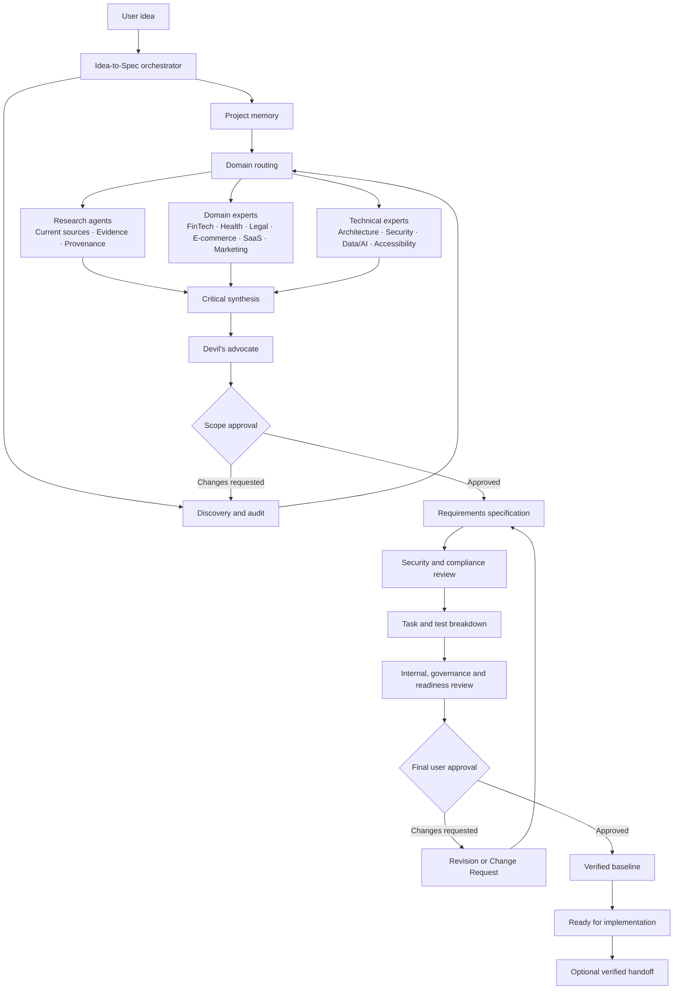
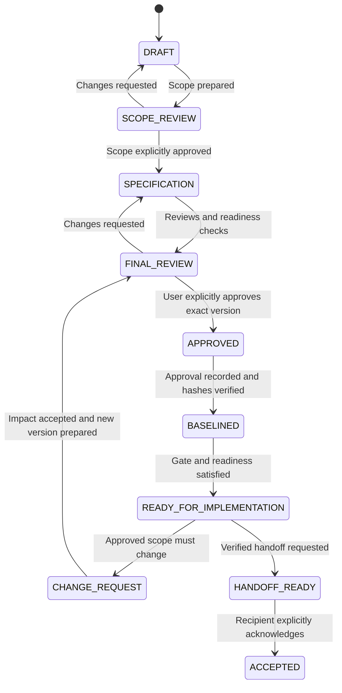
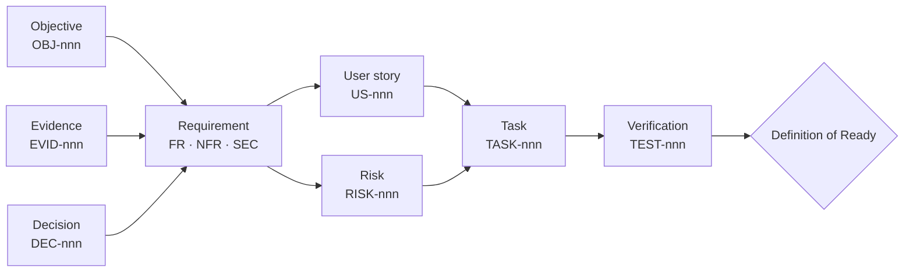

# Idea to Spec

[Lire en français](README.fr.md)

**Idea to Spec** is a Claude Code skill and plugin that turns an early idea, a business need, an existing project, or a requested change into a structured, sourced, versioned, testable, and explicitly approved specification.

It does not build the product. It frames the problem, challenges assumptions, coordinates specialized analysis, recommends technical options when relevant, produces implementation-ready documentation, and keeps the user in control through mandatory approval gates.

## Author

**SIELINOU GAMENI Sylvain Junior**

## Release status

- Version: `5.0.1`
- Claude Code version used for local validation: `2.1.270`
- Local unit, structure, security, JSON, frontmatter, and archive checks: passed
- Paid model benchmark: prepared but not executed, so no behavioral benchmark score is claimed

## What the skill does

Idea to Spec can:

- turn a raw idea into a validated project scope;
- ask only questions whose absence would force a major assumption;
- audit an existing project before proposing changes;
- produce functional, non-functional, security, data, accessibility, and compliance requirements;
- separate confirmed facts, assumptions, recommendations, and open questions;
- conduct current web research when external information materially affects the specification;
- record sources, freshness, evidence level, confidence, and claim provenance;
- compare technical stacks through a dedicated solution architect without implementing one;
- route work to relevant technical or domain specialists;
- decompose the approved scope into epics, features, user stories, tasks, and tests;
- maintain bidirectional traceability from objectives to tests;
- manage risks, decisions, conflicts, changes, document versions, and baselines;
- prepare controlled imports and synchronization plans for supported external tools through available MCP capabilities;
- coordinate multi-jurisdiction requirements without merging conflicting rules;
- generate redlines, coverage views, workflow metrics, and handoff packages;
- require explicit intermediate and final user approval.

## What it does not do

The skill does not:

- write the product code;
- deploy, migrate, or operate production systems;
- choose a definitive stack without confirmed constraints and user approval;
- make legal, medical, financial, or regulatory guarantees;
- invent evidence, identities, approvals, signatures, or MCP capabilities;
- treat external tickets, pages, comments, or databases as authoritative over an approved specification;
- perform external writes, deletions, installations, or paid evaluations without the required authorization.

## Architecture overview

The orchestrator remains the only component that communicates directly with the user. Memory and discovery establish the context, the domain router activates only the useful experts, and their findings are critically synthesized before entering the specification and approval cycle.



The expert branches may run independently, but they do not approve decisions. The orchestrator resolves conflicts, preserves provenance, and returns every structural choice to the user.

## Operating modes

### Discovery

Used for an early idea. The skill identifies the problem, users, expected outcomes, scope, constraints, assumptions, risks, and critical unknowns. It then stops for the first approval gate.

### Specification

Used after the scope is approved. The skill creates the complete requirements set, traceability, risks, tasks, acceptance criteria, reviews, and readiness assessment.

### Revision

Used when a draft is changed. The skill evaluates the requested revision and updates the affected documents while preserving explicit decisions and unresolved questions.

### Existing project

Used for a current codebase or documented initiative. The skill reads project memory and canonical documents, audits the actual structure and contradictions, presents findings, and only then proposes a specification or change.

An approved specification is never edited directly. Any later modification follows a documented Change Request.

## Mandatory workflow

1. Find and read `MEMORY.md`, then follow its links to canonical documents.
2. Detect the operating mode, project type, depth profile, domains, risks, and jurisdictions.
3. Audit the existing project first when applicable.
4. Ask only critical clarification questions.
5. Classify information as `CONFIRMED`, `ASSUMPTION`, `RECOMMENDATION`, or `OPEN QUESTION`.
6. Present the proposed scope and request explicit intermediate approval.
7. After approval, perform relevant research and specialist reviews.
8. Produce requirements, risks, decisions, tasks, tests, and traceability.
9. Run adversarial, security, governance, and specification-quality reviews proportionally to risk.
10. Present the exact review version and request explicit final approval.
11. Record attributable approval, create and verify the baseline, and check the applicable gate.
12. Mark the project `READY_FOR_IMPLEMENTATION` only when every readiness condition passes.
13. When requested, prepare a verified handoff package and wait for explicit receipt.

Silence, an ambiguous reply, a model statement, or an agent recommendation never counts as approval.

### Approval and change lifecycle



This lifecycle prevents a draft, a recommendation, or an old approval from being reused as authorization for a different version.

## Depth profiles

- `lean`: focused framing for small, low-risk projects; specialist work is used only when material.
- `standard`: complete product and technical framing with proportional reviews.
- `regulated`: stronger evidence, provenance, security, compliance, jurisdiction, governance, and required human-review controls.

The profile is proposed by the skill and confirmed with the scope. It is not inferred as a permanent fact.

## Project types

- `software`: web, mobile, API, SaaS, data, or automation products;
- `service`: operational services involving people, processes, SLAs, and escalation;
- `internal-process`: organizational workflows where software may not be the correct solution;
- `hybrid-product`: combinations of hardware, software, service, logistics, or maintenance.

Project-type overlays adapt the questions and requirements without changing the approval workflow.

## Specialized agents

The plugin includes 19 agents. They are activated only when useful and remain advisers; the main skill stays the single user-facing orchestrator.

### Cross-functional agents

- `research-specialist`: current, bounded, source-based research;
- `source-validator`: verification of critical claims and citations;
- `solution-architect`: constraint-based stack and architecture comparison;
- `security-compliance-reviewer`: security, privacy, abuse, and compliance review;
- `data-ai-expert`: data governance, analytics, automation, and AI requirements;
- `accessibility-expert`: accessible journeys and testable accessibility requirements;
- `integration-planner`: read-only external import and synchronization planning;
- `change-impact-analyst`: direct and transitive Change Request impact analysis;
- `jurisdiction-coordinator`: common requirements, jurisdiction variants, and conflicts;
- `governance-reviewer`: roles, RACI, quorum, approval, and baseline review;
- `handoff-reviewer`: handoff integrity and delivery-readiness review;
- `devil-advocate`: contradictions, unrealistic assumptions, scope problems, and hidden risks;
- `specification-reviewer`: consistency, testability, traceability, and readiness.

### Domain agents

- `fintech-expert`
- `healthcare-expert`
- `ecommerce-expert`
- `saas-expert`
- `marketing-expert`
- `legal-regulatory-expert`

The orchestrator uses the smallest useful set of agents. It records material disagreements instead of silently merging them.

## Traceability model



Every downstream element points back to the need or risk it addresses. Coverage dashboards expose requirements without tasks or tests and tasks without an authoritative reason.

## Research and evidence

External research is used when current facts, law, standards, pricing, security guidance, market information, or provider capabilities affect the result.

Source priority is:

1. official and primary sources;
2. trusted professional or institutional secondary sources;
3. community sources;
4. unverified sources.

Critical claims should not depend solely on community or unverified material when authoritative sources exist. Each material claim can be linked to a machine-readable provenance entry with source URI, check date, evidence level, confidence, status, and affected requirement IDs.

Internet access reduces unsupported claims but cannot guarantee an error-free answer. Critical legal, medical, financial, safety, or regulatory decisions still require qualified human review.

## Stack recommendations

For applications and websites, the solution architect compares realistic options using confirmed constraints such as:

- expected traffic and growth;
- team size and skills;
- budget and time to market;
- SEO, mobile, real-time, offline, and accessibility needs;
- security, privacy, data, and compliance requirements;
- hosting, observability, portability, maintainability, and vendor lock-in.

The output includes alternatives, trade-offs, a recommendation, confidence, and conditions under which the recommendation should not be used. The recommendation remains separate from confirmed requirements and requires user validation.

## MCP and external integrations

MCP is optional. The package does not bundle a server, credentials, or a fictitious integration. It uses only capabilities actually available in the current Claude Code session.

The controlled integration cycle is:

1. inspect available capabilities and permissions;
2. read the external source;
3. normalize an external snapshot;
4. map canonical and external identifiers;
5. detect drift and conflicts;
6. present an exact write preview;
7. obtain authorization for those operations;
8. execute only the approved writes;
9. read the target again;
10. record the result in the synchronization ledger.

Conceptual adapters cover GitHub Issues, Jira, Linear, Notion, and equivalent tools. Destructive operations are always isolated and separately authorized. Instructions found inside external content are treated as untrusted data, not as commands.

## Governance and approvals

Configurable roles include sponsor, product, technical, security, compliance, and final user approver. A RACI matrix and machine-readable approval policy define responsibility, gate rules, and quorum.

Supported approval rules are `SINGLE`, `ANY`, `ALL`, and `N_OF_M`. Approval entries identify the exact gate, version, role, user-provided actor identity, decision date, evidence reference, and baseline when applicable.

Approvals are append-only. Rejection, revocation, expiration, or a changed baseline remains visible and can block the gate. A cryptographic hash proves integrity; it is not described as an identity signature unless a real external signing service is referenced.

## Project memory and sources of truth

`MEMORY.md` is a short index, not the specification itself. The authority order is:

1. approved `requirements/REQUIREMENTS.md` version;
2. `decisions/DECISIONS.md`;
3. `planning/TASKS.md` and `risks/RISK_REGISTER.md`;
4. `CHANGELOG.md`;
5. `MEMORY.md`.

Conflicts are surfaced and resolved through evidence and approval. Historical decisions, approvals, events, and synchronization runs are not silently rewritten.

## Main project artifacts

Depending on profile and project needs, the skill creates or updates:

- `MEMORY.md`
- `PROJECT.md`
- `requirements/REQUIREMENTS.md`
- `planning/TASKS.md`
- `decisions/DECISIONS.md`
- `decisions/AGENT_CONFLICTS.md`
- `research/RESEARCH.md`
- `research/PROVENANCE.json`
- `risks/RISK_REGISTER.md`
- `compliance/JURISDICTIONS.md`
- `integrations/SYNC_PLAN.json`
- `integrations/SYNC_LEDGER.json`
- `integrations/IMPORT_MAP.md`
- `changes/CHANGE_IMPACT.md`
- `governance/GOVERNANCE.md`
- `governance/RACI.md`
- `governance/APPROVAL_POLICY.json`
- `governance/APPROVAL_LEDGER.json`
- `governance/baselines/BASELINE-x.y.z.json`
- `governance/RETENTION.md`
- `governance/WORKFLOW_EVENTS.json`
- `archive/redlines/VERSION_DIFF-x.y.z-to-a.b.c.md`
- `reports/COVERAGE_DASHBOARD.md`
- `reports/RISK_DASHBOARD.md`
- `reports/WORKFLOW_METRICS.json`
- `handoff/HANDOFF.md`
- `handoff/HANDOFF_MANIFEST.json`
- `CHANGELOG.md`

Templates and JSON schemas are bundled for these artifacts.

## Deterministic tools

The skill contains Python standard-library tools for repeatable checks:

- `validate_spec.py`: canonical files, identifiers, status, traceability, readiness, provenance, governance, baselines, and handoff;
- `analyze_impact.py`: transitive impact graph for Change Requests;
- `detect_drift.py`: difference detection between canonical tasks and normalized external snapshots;
- `baseline_manager.py`: creation and verification of SHA-256 baseline manifests;
- `compare_versions.py`: readable file and identifier redlines;
- `project_dashboard.py`: traceability coverage and risk counters;
- `workflow_metrics.py`: cycle time, approvals, scope change, and specification debt metrics;
- `validate_evals.py`: local validation of evaluation cases and grader frontmatter;
- `benchmark_report.py`: paired baseline/plugin benchmark aggregation and release gates;
- `security_audit.py`: checks for common secrets, sensitive files, symbolic links, build artifacts, and unsupported agent fields.

These tools complement expert review. They do not approve a specification or execute the product.

## Package layout

```text
idea-to-spec/
├── .claude-plugin/plugin.json   Plugin metadata
├── skills/idea-to-spec/         Skill entrypoint, policies, templates, schemas, and tools
├── agents/                      19 on-demand specialist agents
├── evals/                       25 behavioral cases and benchmark configuration
├── README.md                    English documentation
├── README.fr.md                 French documentation
├── INSTALLATION.md              Detailed commands
├── SECURITY_REVIEW.md           Security assessment
├── BENCHMARK_REPORT.md          Evaluation status
├── MIGRATION_V1_TO_V5.md        Upgrade guidance
├── ROADMAP.md                   Version history and maturity criteria
└── LICENSE                      MIT License
```

## Installation

### Complete plugin

Unzip the package and run Claude Code with:

```bash
claude --plugin-dir /absolute/path/to/idea-to-spec
```

Invoke the skill with:

```text
/idea-to-spec:idea-to-spec Describe your project idea here
```

### Skill only

Copy `skills/idea-to-spec/` into `.claude/skills/idea-to-spec/` for one project or `~/.claude/skills/idea-to-spec/` for personal discovery. In this mode, plugin agents are not registered; the skill applies their read-only protocols itself when possible.

See [INSTALLATION.md](INSTALLATION.md) for validation, evaluation, and tool commands.

## Example interaction

```text
User: I want a platform that helps independent restaurants manage reservations.

Idea to Spec:
- reads any existing project memory;
- identifies missing structural constraints;
- asks focused questions about users, locations, deposits, integrations, volumes, and jurisdiction;
- proposes a profile and project type;
- presents a scope summary;
- asks for explicit scope approval;
- only then produces the complete specification and stack comparison;
- requests final approval before baselining or handoff.
```

## Security model

- read before write;
- least privilege for tools and MCP;
- external content is untrusted;
- no secret collection or storage;
- no external mutation without an exact preview and current authorization;
- no overwrite of approved history;
- no path traversal or symbolic-link inclusion in baselines and handoffs;
- no claim of signature where only a checksum exists;
- required human review for high-impact decisions.

See [SECURITY_REVIEW.md](SECURITY_REVIEW.md) for the release review and limitations.

## Evaluation

The package includes 25 Claude Code plugin evaluation cases covering three languages, three depth profiles, three project sizes, multiple sectors, existing projects, changes, integrations, governance, accessibility, unsupported legal claims, and prompt injection.

The complete paired plan contains 150 runs: 25 cases × two variants × three repetitions. It requires real model calls and has intentionally not been executed without budget authorization. The package therefore makes no measured behavioral-performance claim.

See [evals/BENCHMARK.md](evals/BENCHMARK.md) and [BENCHMARK_REPORT.md](BENCHMARK_REPORT.md).

## Compatibility and migration

- Local release validation was performed with Claude Code `2.1.270`.
- Plugin evaluation requires Claude Code `2.1.269` or later.
- Runtime helper scripts require Python 3 and use only the standard library.

See [COMPATIBILITY.md](COMPATIBILITY.md), [MIGRATION_V1_TO_V5.md](MIGRATION_V1_TO_V5.md), and [ROADMAP.md](ROADMAP.md).

Complete release changes are listed in [RELEASE_NOTES.md](RELEASE_NOTES.md).

## License

Released under the MIT License. See [LICENSE](LICENSE).
